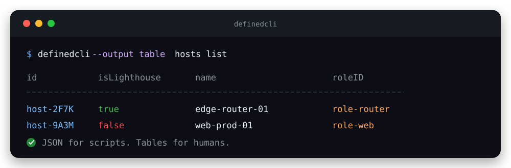

<div align="center">

# Defined Networking Python Client

**One client. Two interfaces. Simple automation for Defined Networking.**

[](https://www.python.org/)
[](https://github.com/rrajpuro/defined-python-client/actions/workflows/quality.yml)
[](docs/cli.md)
[](docs/python.md)
[](LICENSE.md)

[Quick start](#quick-start) · [Install](#install) ·
[CLI guide](docs/cli.md) · [Python guide](docs/python.md) ·
[API reference](https://docs.defined.net/api/defined-networking-api/)

</div>

---

`defined-client` is a Python toolkit for the
[Defined Networking API](https://docs.defined.net/api/defined-networking-api/).
It combines a script-friendly CLI with a typed Python package and safer
high-level services.

| ⚡ Script-friendly CLI | 🐍 Typed Python API | 🛡️ Safer updates |
| :---: | :---: | :---: |
| JSON for automation and tables for humans | Inline types and a `py.typed` marker | GET–merge–PUT helpers preserve omitted fields |

Hosts, roles, routes, tags, networks, audit logs, and public software downloads
are supported. Python 3.13 or newer is required.

> [!NOTE]
> This is an independent project and is not affiliated with, endorsed by, or
> sponsored by Defined Networking.

<p align="center">
  
</p>

## Quick start

Use the CLI for shell automation and interactive administration:

```bash
export DEFINED_API_KEY='dnkey-...'
definedcli --output table hosts list
definedcli hosts get-by-name --name edge-router-01
```

Use the Python package when integrating Defined Networking into an application:

```python
import os

from defined_client import DefinedClient, HostService

with DefinedClient(api_key=os.environ["DEFINED_API_KEY"]) as client:
    hosts = HostService(client)
    host = hosts.get_by_name("edge-router-01")
    print(host["id"])
```

## Install

Install the CLI as an isolated tool from GitHub:

```bash
uv tool install git+https://github.com/rrajpuro/defined-python-client
definedcli --version
```

Install the package into a uv-managed Python project:

```bash
uv add git+https://github.com/rrajpuro/defined-python-client
```

From a local checkout, use:

```bash
uv tool install .
```

Reinstall with `--force` after changing local source code.

## Authentication

Create an API key in the
[Defined Networking admin panel](https://admin.defined.net/settings/api-keys).
The key must include the scopes required by the operations you call.

The CLI reads the key only from `DEFINED_API_KEY`:

```bash
export DEFINED_API_KEY='dnkey-...'
```

Python applications pass the key to `DefinedClient`. Avoid hard-coding it;
load it from your environment or secret manager instead.

The public downloads endpoint is the only supported operation that does not
require authentication.

## Resource coverage

| Resource | Supported operations |
| --- | --- |
| Hosts | Create, list, get, update, delete, block, unblock, enroll, debug |
| Roles | Create, list, get, update, delete |
| Routes | Create, list, get, update, delete |
| Tags | Create, list, get, update, delete, manage route subscriptions |
| Networks | Create, list, get, update |
| Audit logs | List and filter |
| Downloads | List public downloads |

All Python resource methods return the API response envelope, with resource
content under `data` and pagination information under `metadata` when supplied
by the API.

## Update safety

Defined Networking update endpoints use full-replacement `PUT` semantics.
Calling a low-level resource `update()` with an incomplete document can reset
omitted fields.

- CLI `update` commands and Python `*Service.safe_update()` methods first fetch
  the object, merge the requested changes, and send the complete mutable state.
- CLI `replace` commands and low-level Python resource `update()` methods are for
  deliberate API-shaped replacements.

Safe updates use a GET-then-PUT sequence and can still race with another writer.

<details>

<summary><strong>Explore the complete CLI command tree</strong></summary>

| Resource | Commands |
| --- | --- |
| `hosts` | `create`, `create-with-enrollment`, `list`, `get`, `get-by-name`, `find-by-name`, `update`, `replace`, `delete`, `block`, `unblock`, `debug-command`, `create-enrollment-code`, `update-tags`, `add-tag`, `remove-tag` |
| `roles` | `create`, `list`, `get`, `update`, `replace`, `delete` |
| `routes` | `create`, `list`, `get`, `get-by-name`, `find-by-name`, `update`, `replace`, `delete`, `update-router-host` |
| `tags` | `create`, `list`, `get`, `find-by-key`, `update`, `replace`, `delete`, `subscribe-route`, `unsubscribe-route` |
| `networks` | `create`, `list`, `get`, `update`, `replace` |
| `audit-logs` | `list` |
| `downloads` | `list` (public) |

</details>

## Documentation

- [CLI guide](docs/cli.md) — commands, JSON input, output, pagination, and errors
- [Python guide](docs/python.md) — client lifecycle, resources, services, and
  exception handling
- [Development guide](docs/development.md) — environment setup, tests, and
  repository layout
- [Defined Networking API reference](https://docs.defined.net/api/defined-networking-api/)

## License

This project is distributed under the terms in [LICENSE.md](LICENSE.md).
